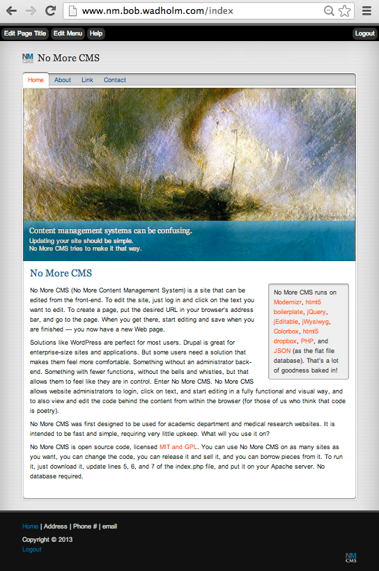

No More CMS
===========

No More CMS (No More Content Management System) is a site that is editable from the front end. You can view a working No More CMS site at http://nm.bob.wadholm.com. 

To edit a No More CMS site, just log in and click on the text or media you want to edit. To create a page, put the desired URL in your browser's address bar, and go to the page. When you get there, start editing and save when you are finished — you now have a new Web page. No More CMS has a click-to-edit WYSIWYG, html code editing, and image file uploader built right in.  

Solutions like WordPress are perfect for most users. Drupal is great for enterprise-size sites and applications. But some users need a solution that makes them feel more comfortable. Something without an administrator back-end. Something with fewer functions, without the bells and whistles, but that allows them to feel like they are in control. Enter No More CMS. No More CMS allows website administrators to login, click on text, and start editing in a fully functional and visual way, and to also view and edit the code behind the content from within the browser (for those of us who think that code is poetry). 

No More CMS was first designed to be used for academic department and medical research websites. It is intended to be fast and simple, requiring very little upkeep. What will you use it on?

No More CMS runs on Modernizr, html5 boilerplate, jQuery, jEditable, jWysiwyg, Colorbox, html5 dropbox, PHP, and JSON (as the flat file database). That's a lot of goodness baked in! No More CMS is open source code, licensed MIT and GPL (http://www.bob.wadholm.com/licenses.shtml). You can use No More CMS on as many sites as you want, you can change the code, you can release it and sell it, and you can borrow pieces from it. To run it, download it, update lines 5, 6, and 7 of the index.php file, and change the site title in pages/index.json, and put the files on your Apache server. No database required. From there, you can feel free to hack on the index.php and CSS. 

